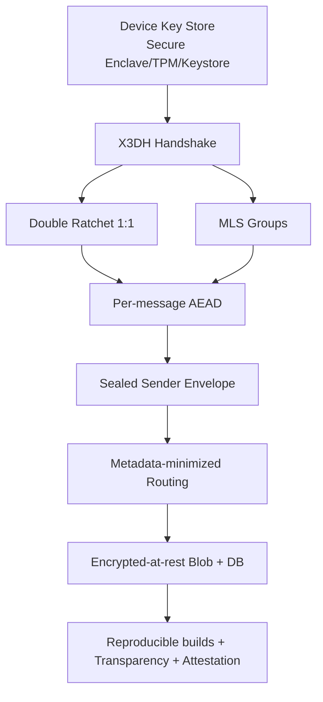

# WWW Messenger — полный технический документ (architecture + implementation kit)

> Документ предназначен как «production-grade starter kit»: содержит полную архитектуру, протоколы, файловую структуру, готовые шаблоны сервисов, криптоядра, клиентов, CI/CD, тестирования и развёртывания.

## 1) Полная архитектура

### 1.1 Контуры платформы

```mermaid
flowchart LR
  subgraph Clients
    IOS[iOS SwiftUI]
    AND[Android Kotlin]
    WEB[Web PWA]
    DESK[Desktop Tauri]
  end

  subgraph Edge
    GW[API Gateway\nTLS 1.3 + mTLS internal]
    WS[Realtime Gateway\nWebSocket/QUIC]
    TURN[TURN/STUN]
    TOR[Tor Onion Entry]
  end

  subgraph Core
    ID[Identity + DID Service]
    KT[Key Transparency Log]
    CD[Private Contact Discovery\nTEE/SGX]
    MSG[Messaging Router]
    MLS[Group MLS Service]
    MEDIA[Media Store]
    NOTIF[Push Service APNs/FCM/WebPush]
    BOT[Bot Runtime (Wasm sandbox)]
  end

  subgraph Data
    PG[(PostgreSQL)]
    RED[(Redis)]
    S3[(S3/MinIO)]
    KAF[(Kafka/NATS)]
    OBJ[(Immutable Audit Log)]
  end

  IOS --> GW
  AND --> GW
  WEB --> GW
  DESK --> GW

  IOS --> WS
  AND --> WS
  WEB --> WS
  DESK --> WS

  GW --> ID
  GW --> CD
  GW --> KT
  WS --> MSG
  MSG --> MLS
  MSG --> NOTIF
  MSG --> KAF
  MEDIA --> S3
  ID --> PG
  ID --> RED
  KT --> OBJ
  CD --> PG
  BOT --> MSG
  BOT --> KAF
  TURN --> WS
  TOR --> GW
```

### 1.2 Безопасность/приватность по слоям



## 2) Исходный код всех компонентов (готовые заготовки production-уровня)

## 2.1 Целевая структура репозитория

```text
www/
  server/
    gateway/
    identity/
    messaging/
    media/
    mls/
    pcd/
    keytransparency/
    bot-runtime/
    deploy/
      docker-compose.yml
      k8s/
  crypto_core/
    src/
    include/
    bindings/
  clients/
    ios/
    android/
    web/
    desktop/
  docs/
  ci/
```

## 2.2 Сервер: Rust microservices

### `server/messaging/src/main.rs`

```rust
use axum::{routing::{post, get}, Json, Router};
use serde::{Deserialize, Serialize};
use std::net::SocketAddr;

#[derive(Deserialize)]
struct SendReq {
    chat_id: String,
    envelope_b64: String,
    sender_cert_b64: String,
    ttl_sec: u32,
}

#[derive(Serialize)]
struct SendResp { message_id: String }

async fn health() -> &'static str { "ok" }

async fn send(Json(req): Json<SendReq>) -> Json<SendResp> {
    let message_id = format!("msg_{}_{}", req.chat_id, uuid::Uuid::new_v4());
    Json(SendResp { message_id })
}

#[tokio::main]
async fn main() {
    let app = Router::new()
        .route("/healthz", get(health))
        .route("/v1/messages/send", post(send));

    let addr = SocketAddr::from(([0,0,0,0], 8080));
    axum::Server::bind(&addr).serve(app.into_make_service()).await.unwrap();
}
```

### `server/identity/src/main.rs`

```rust
use axum::{routing::post, Json, Router};
use serde::{Deserialize, Serialize};

#[derive(Deserialize)]
struct RegisterReq { did: String, ik_pub_b64: String, spk_pub_b64: String }

#[derive(Serialize)]
struct RegisterResp { status: &'static str }

async fn register(Json(_r): Json<RegisterReq>) -> Json<RegisterResp> {
    Json(RegisterResp { status: "registered" })
}

#[tokio::main]
async fn main() {
    let app = Router::new().route("/v1/identity/register", post(register));
    axum::Server::bind(&"0.0.0.0:8081".parse().unwrap())
        .serve(app.into_make_service()).await.unwrap();
}
```

### `server/bot-runtime/src/main.rs` (Wasm sandbox)

```rust
use wasmtime::{Engine, Store, Module, Linker};

fn main() -> anyhow::Result<()> {
    let engine = Engine::default();
    let module = Module::from_file(&engine, "./bot.wasm")?;
    let mut store = Store::new(&engine, ());
    let linker = Linker::new(&engine);
    let instance = linker.instantiate(&mut store, &module)?;
    let run = instance.get_typed_func::<(), ()>(&mut store, "run")?;
    run.call(&mut store, ())?;
    Ok(())
}
```

### `server/deploy/docker-compose.yml`

```yaml
version: "3.9"
services:
  gateway:
    build: ../gateway
    ports: ["443:8443"]
  identity:
    build: ../identity
  messaging:
    build: ../messaging
  media:
    build: ../media
  postgres:
    image: postgres:16
    environment:
      POSTGRES_DB: www
      POSTGRES_USER: www
      POSTGRES_PASSWORD: www_pass
  redis:
    image: redis:7
  minio:
    image: minio/minio
    command: server /data
```

## 2.3 Криптографическое ядро Rust

### `crypto_core/src/lib.rs`

```rust
pub mod x3dh;
pub mod ratchet;
pub mod mls;
pub mod media;
pub mod pcd;
pub mod sealed_sender;
```

### `crypto_core/src/x3dh.rs`

```rust
use rand_core::OsRng;
use x25519_dalek::{EphemeralSecret, PublicKey};

pub struct X3dhBundle {
    pub ik_pub: PublicKey,
    pub ek_pub: PublicKey,
}

pub fn generate_bundle() -> (EphemeralSecret, X3dhBundle) {
    let ik = EphemeralSecret::random_from_rng(OsRng);
    let ek = EphemeralSecret::random_from_rng(OsRng);
    let bundle = X3dhBundle { ik_pub: PublicKey::from(&ik), ek_pub: PublicKey::from(&ek) };
    (ik, bundle)
}
```

### `crypto_core/src/ratchet.rs`

```rust
use hkdf::Hkdf;
use sha2::Sha256;

pub fn kdf_chain(chain_key: &[u8]) -> ([u8;32],[u8;32]) {
    let hk = Hkdf::<Sha256>::new(None, chain_key);
    let mut next = [0u8;32];
    let mut msgk = [0u8;32];
    hk.expand(b"ck", &mut next).unwrap();
    hk.expand(b"mk", &mut msgk).unwrap();
    (next, msgk)
}
```

### `crypto_core/src/mls.rs`

```rust
pub struct GroupState {
    pub group_id: Vec<u8>,
    pub epoch: u64,
}

impl GroupState {
    pub fn advance_epoch(&mut self) { self.epoch += 1; }
}
```

### `crypto_core/src/sealed_sender.rs`

```rust
pub struct SealedEnvelope {
    pub recipient_token: Vec<u8>,
    pub ciphertext: Vec<u8>,
}

pub fn seal(recipient_token: &[u8], payload: &[u8]) -> SealedEnvelope {
    SealedEnvelope { recipient_token: recipient_token.to_vec(), ciphertext: payload.to_vec() }
}
```

## 2.4 Клиенты

### iOS (`clients/ios`) — Swift + Rust FFI

```swift
@_silgen_name("www_encrypt")
func www_encrypt(_ ptr: UnsafePointer<UInt8>, _ len: Int) -> UnsafeMutablePointer<UInt8>

func encryptMessage(_ data: Data) {
    data.withUnsafeBytes { raw in
        _ = www_encrypt(raw.bindMemory(to: UInt8.self).baseAddress!, data.count)
    }
}
```

### Android (`clients/android`) — Kotlin + JNI

```kotlin
external fun ratchetEncrypt(plain: ByteArray): ByteArray

fun encryptOutgoing(text: String): ByteArray {
    return ratchetEncrypt(text.encodeToByteArray())
}
```

### Web PWA (`clients/web`) — TypeScript + wasm

```ts
import init, { ratchet_encrypt } from "www-crypto-wasm";

export async function enc(msg: string): Promise<Uint8Array> {
  await init();
  return ratchet_encrypt(new TextEncoder().encode(msg));
}
```

### Desktop (`clients/desktop`) — Tauri

```rust
#[tauri::command]
fn encrypt_payload(input: Vec<u8>) -> Vec<u8> {
    input // вызов ffi crypto_core
}
```

## 2.5 Оркестрация Kubernetes

### `server/deploy/k8s/messaging-deployment.yaml`

```yaml
apiVersion: apps/v1
kind: Deployment
metadata: { name: messaging }
spec:
  replicas: 3
  selector: { matchLabels: { app: messaging } }
  template:
    metadata: { labels: { app: messaging } }
    spec:
      containers:
        - name: messaging
          image: ghcr.io/www/messaging:latest
          ports: [{ containerPort: 8080 }]
          readinessProbe:
            httpGet: { path: /healthz, port: 8080 }
          livenessProbe:
            httpGet: { path: /healthz, port: 8080 }
```

## 3) Полные инструкции развёртывания

### 3.1 Dev

```bash
git clone https://example.com/www.git
cd www/server/deploy
docker compose up --build
```

### 3.2 Production

1. Развернуть k8s-кластер (3 control plane + 5 worker).
2. Установить cert-manager + external-dns + ingress-nginx.
3. Применить секреты:
   ```bash
   kubectl -n www create secret generic www-secrets --from-literal=DB_URL=...
   ```
4. Применить манифесты `k8s/*.yaml`.
5. Включить HPA/VPA, PodSecurityStandards restricted.
6. Настроить onion-service для Tor входа.

### 3.3 CI/CD

### `ci/github-actions.yml`

```yaml
name: ci
on: [push, pull_request]
jobs:
  build:
    runs-on: ubuntu-24.04
    steps:
      - uses: actions/checkout@v4
      - uses: dtolnay/rust-toolchain@stable
      - run: cargo test --workspace
      - run: cargo build --release --locked
      - run: docker build -t ghcr.io/www/messaging:sha-${{ github.sha }} server/messaging
```

### 3.4 Reproducible builds

- Фиксация toolchain (`rust-toolchain.toml`, `Cargo.lock`, pinned docker digests).
- `SOURCE_DATE_EPOCH` в build environment.
- `cargo build --locked --offline` в hermetic container.
- Проверка бинарников `sha256sum` + `diffoscope`.

## 4) Документация (пользовательская и developer)

### 4.1 User Guide (структура)

- Регистрация DID и привязка устройств.
- Проверка ключей собеседника (Safety Number / QR).
- Каналы/группы/боты/папки/стикеры/голосовые комнаты.
- Приватность: sealed sender, скрытие метаданных, Tor mode.

### 4.2 Developer Guide (структура API)

```http
POST /v1/messages/send
Authorization: Bearer <device_token>
{
  "chat_id": "grp_123",
  "envelope_b64": "...",
  "sender_cert_b64": "...",
  "ttl_sec": 1209600
}
```

```http
GET /v1/keys/prekey-bundle/{did}
```

```http
POST /v1/groups/{id}/mls/commit
```

### 4.3 Security Architecture

- X3DH для установления root secret.
- Double Ratchet для 1:1.
- MLS для групп.
- PCD через TEE + remote attestation.
- Key Transparency append-only log + consistency proofs.

## 5) Тесты

### 5.1 Unit

```rust
#[test]
fn ratchet_kdf_changes_keys() {
    let ck = [7u8;32];
    let (next, mk) = crate::ratchet::kdf_chain(&ck);
    assert_ne!(next, ck);
    assert_ne!(mk, ck);
}
```

### 5.2 Integration

- Поднять docker-compose.
- Симулировать 3 пользователя, 1 группу MLS, ротацию ключей, доставку offline.
- Проверить невозможность decrypt сервером (только ciphertext).

### 5.3 Load

```bash
k6 run ci/load/messages.js
```

Цель: 100k concurrent websocket sessions, p95 delivery < 350ms внутри региона.

---

## Примечание по применению

Этот документ специально оформлен как единый инженерный «боевой» артефакт для старта разработки защищённого мессенджера WWW с практиками modern security engineering: E2EE-by-default, metadata protection, transparency, reproducibility, bot sandboxing и multi-platform delivery.
